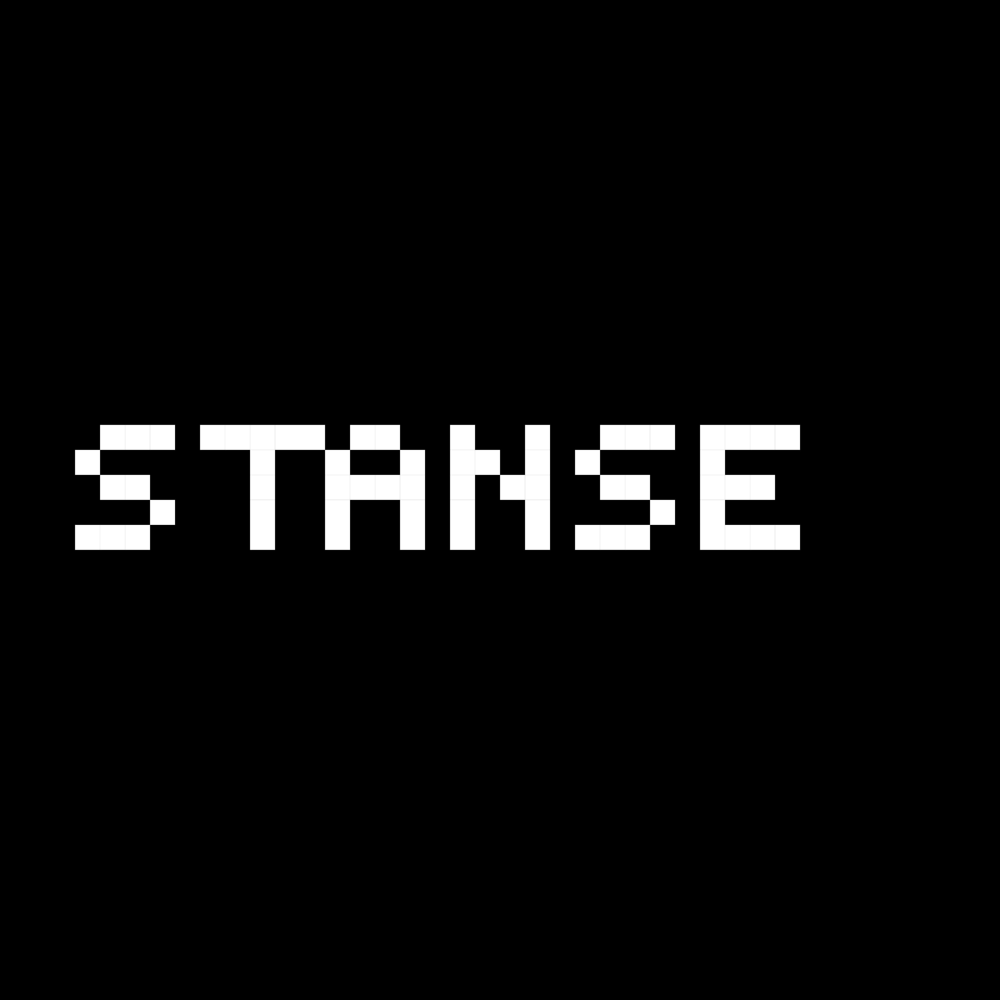
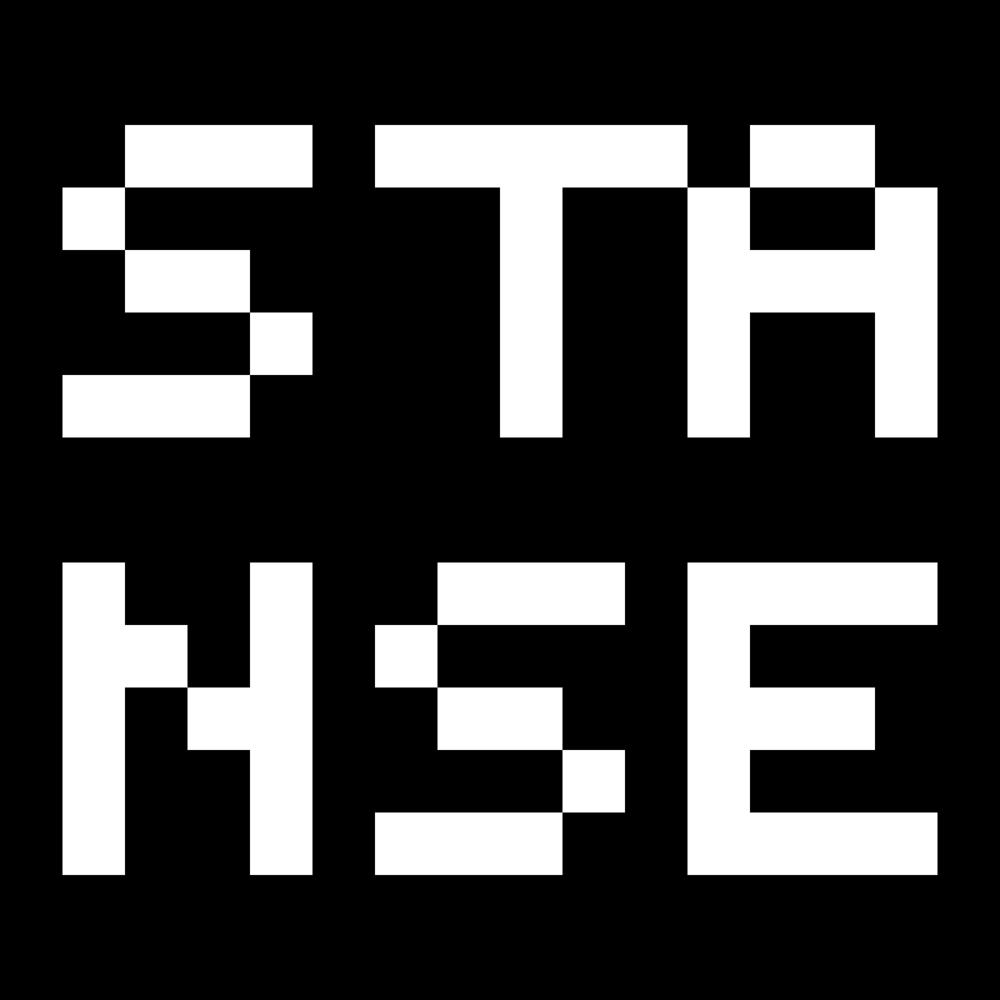

<div align="center">
  
  <br /><br />
  
  <br /><br />
  <strong>Where You Stand Matters</strong>
  <br /><br />

  [](https://stanse.ai)
  [](https://firebase.google.com)
  [](https://cloud.google.com/run)
  [](https://www.typescriptlang.org)
  [](https://react.dev)
  [](#multilingual-support)
</div>

---

## Overview

**Stanse** is an AI-powered political and economic value alignment platform. It helps users discover their political coordinates, evaluate brands against their values, consume personalized multi-language news, participate in collective action campaigns, and compete in real-time political knowledge duels.

> *Your stance is your power. Every consumption choice, every piece of information, every collective action — is an expression of who you are.*

**Production URL:** https://stanse.ai

---

## Table of Contents

- [Core Features](#core-features)
- [Architecture](#architecture)
- [Tech Stack](#tech-stack)
- [Project Structure](#project-structure)
- [Getting Started](#getting-started)
- [Deployment](#deployment)
- [Firebase Cloud Functions](#firebase-cloud-functions)
- [Security](#security)
- [Multilingual Support](#multilingual-support)
- [Documentation](#documentation)

---

## Core Features

<div align="center">
  
</div>

### STANCE — Political Fingerprint
AI-driven political calibration across three axes: **Economic** (socialist ↔ free-market), **Social** (conservative ↔ progressive), and **Diplomatic** (nationalist ↔ internationalist). Users complete a structured questionnaire covering geopolitical positions and ideological values. The result is a unique 3-axis radar chart and an AI-generated persona label (e.g. *"Chinese-American Conservative Socialist"*) — available in all 5 supported languages.

### SENSE — Brand Intelligence Scanner
Enter any brand, company, or public figure to receive an instant political alignment analysis. The report includes:
- Alignment score (0–100) against the user's political coordinates
- FEC political donation data (for U.S. companies) with party-breakdown visualization
- Social media signal analysis
- Key conflict/alignment points
- Alternative brand recommendations for low-scoring entities

### FEED — Personalized News Feed
A fully personalized news stream powered by:
- **Google News RSS** across 5 languages with language-specific `Accept-Language` headers
- **Gemini AI embeddings** (`text-embedding-004`, 768 dimensions) for semantic persona-to-news matching
- **AI Prism** — every news item can be expanded into three perspectives: *Supporting*, *Opposing*, and *Neutral*
- Real-time market signal strip showing 10 stance-aligned stocks (5 long / 5 short)
- AI-generated daily market commentary tailored to the user's political portfolio

### UNION — Collective Action Hub
Built on the custom **Polis Protocol** (Rust + blockchain), UNION enables:
- Real-time tracking of active allies across the network
- Participation in **Boycott**, **Buycott**, and **Petition** campaigns
- Zero-knowledge proof-based action recording for privacy-preserving participation
- Personal and collective impact dashboards — tracking "redirected capital"
- Decentralized identity (DID: `did:polis:firebase:<userId>`)

### DUEL — Real-Time PvP Arena
A 1v1 political knowledge quiz with financial stakes:
- Smart matchmaking by stance type, ping latency, and entry fee
- Entry fees from $1 to $20 with optional safety-belt insurance
- Image-based Q&A format with speed bonuses and combo multipliers
- AI opponent fallback when no human match is found within 30 seconds
- Full wallet management: deposit, withdraw, and transaction history

---

## Architecture

Stanse spans two GCP projects with distinct responsibilities:

```
┌─────────────────────────────────────────────────────────────────┐
│                    gen-lang-client-0960644135                   │
│                                                                 │
│  ┌────────────┐  ┌─────────────────┐  ┌───────────────────┐    │
│  │   stanse   │  │ polis-protocol  │  │   stanseagent     │    │
│  │ React+nginx│  │  Rust + P2P     │  │   Next.js AI      │    │
│  │ Cloud Run  │  │  Cloud Run      │  │   Cloud Run       │    │
│  └────────────┘  └─────────────────┘  └───────────────────┘    │
│                                                                 │
│  ┌────────────┐  ┌────────────────────────────────────────┐    │
│  │  ember-api │  │          Cloud Scheduler (7 jobs)       │    │
│  │  Python    │  │  Rankings · ESG · FEC · Polygon · Radar │    │
│  │  Cloud Fn  │  └────────────────────────────────────────┘    │
│  └────────────┘                                                 │
│                                                                 │
│              Secret Manager · Cloud Build · Artifact Registry  │
└─────────────────────────────────────────────────────────────────┘

┌─────────────────────────────────────────────────────────────────┐
│                       stanseproject                             │
│                                                                 │
│  Firebase Cloud Functions (31)   Firestore   Realtime Database  │
│  ├── fetchGoogleNewsRSS          news/       presence/          │
│  ├── checkBreakingNews           news_emb/   matchmaking_queue/ │
│  ├── scheduledNewsFetch          duel_*/     active_matches/    │
│  ├── runDuelMatchmaking (1min)   users/                        │
│  ├── processMonthlyRenewals      revenue/                      │
│  └── 26 more functions...                                       │
└─────────────────────────────────────────────────────────────────┘
```

### News Pipeline

```
User requests news (language: "fr")
        ↓
fetchGoogleNewsRSS Cloud Function
        ↓
Google News RSS  ←  Accept-Language: fr-FR,fr;q=0.9
        ↓
5 categories × up to 5 items (POLITICS, TECH, MILITARY, WORLD, BUSINESS)
        ↓
services/agents/newsAgent.ts
        ↓
Gemini text-embedding-004 (768-dim, language-aware)
        ↓
Cosine similarity against user's embeddingFR
        ↓
Personalized, ranked feed
```

### Breaking News Pipeline

```
checkBreakingNews (every 30min, EST peak hours)
        ↓
Google Search Grounding → English detection
        ↓
TIER 1 / TIER 2 filter (explicit labels or critical events)
        ↓
Parallel translation: ZH · JA · FR · ES  (Gemini)
        ↓
5 Firestore documents (same titleHash, unique per-language ID)
        ↓
Push notification → Firebase Cloud Messaging
```

---

## Tech Stack

| Layer | Technology |
|---|---|
| **Frontend** | React 19, Vite, TypeScript, TailwindCSS |
| **State / Auth** | Firebase Auth, Firestore, Realtime Database |
| **AI / LLM** | Google Gemini 2.5 Flash, `text-embedding-004` |
| **AI Framework** | Ember (Python, compound LLM composition) |
| **News** | Google News RSS, 6park Chinese media |
| **Blockchain** | Polis Protocol (Rust, Libp2p, Ed25519, Blake3) |
| **Backend** | Firebase Cloud Functions v2 (Node.js 20) |
| **Infra** | Google Cloud Run, Cloud Build, Cloud Scheduler |
| **Secrets** | Google Secret Manager |
| **Build** | Vite, Docker (multi-stage), nginx |
| **Code Gen Agent** | StanseAgent (Next.js, E2B sandbox, Vercel AI SDK) |

---

## Project Structure

```
Stanse/
├── App.tsx                          # Root component (auth, language, routing)
├── index.tsx                        # React entry point
├── components/
│   ├── views/                       # Main page views
│   │   ├── FeedView.tsx             # News feed + market signals
│   │   ├── SenseView.tsx            # Brand scanner
│   │   ├── ImpactView.tsx           # STANCE radar
│   │   ├── SettingsView.tsx         # User settings
│   │   └── ...
│   ├── ai-chat/                     # Ember AI chat sidebar
│   ├── globe/                       # 3D global intelligence map
│   ├── charts/                      # Data visualizations
│   ├── modals/                      # Modal dialogs
│   └── ui/                          # Base UI components
├── services/
│   ├── agents/                      # News orchestration agents
│   │   ├── newsAgent.ts             # RSS fetch + AI processing
│   │   ├── types.ts                 # Agent type definitions
│   │   └── index.ts                 # Orchestrator entry point
│   ├── geminiService.ts             # Gemini LLM integration
│   ├── userPersonaService.ts        # Persona + multi-language embeddings
│   ├── companyRankingService.ts     # Company ranking + FEC data
│   ├── duelService.ts               # Duel Arena logic
│   ├── polisApi.ts                  # Polis Protocol client
│   ├── firebase.ts                  # Firebase initialization
│   └── ...                          # 35+ additional services
├── functions/
│   └── src/
│       ├── index.ts                 # All Cloud Functions exports
│       ├── news-rss-fetcher.ts      # Google News RSS (multi-language)
│       ├── scheduled-news-fetcher.ts
│       ├── breaking-news-checker.ts
│       ├── duel/                    # Duel Arena functions
│       └── api/                     # Globe markers, entity location
├── backend/
│   └── polis-protocol/              # Rust blockchain service
├── ember-main/                      # Python LLM composition framework
├── stanse-agent/                    # Next.js AI code generation agent
├── documentation/                   # 107 technical docs
│   ├── backend/                     # 77 backend docs (01–77)
│   ├── frontend/                    # 28 frontend docs (00–27)
│   └── ml/                          # 2 ML docs (01–02)
├── public/                          # Static assets + PWA icons
├── cloudbuild.yaml                  # Cloud Build CI/CD
└── firebase.json                    # Firebase project config
```

---

## Getting Started

### Prerequisites

- Node.js 20+
- Firebase CLI: `npm install -g firebase-tools`
- Google Cloud SDK (`gcloud`)
- Access to `stanseproject` and `gen-lang-client-0960644135` GCP projects

### Local Development

```bash
# Install dependencies
npm install

# Start dev server
npm run dev
```

The app will be available at `http://localhost:5173`.

> **Note:** Some features (RSS news, AI analysis) require the Cloud Functions to be deployed. For local Cloud Functions development:
> ```bash
> cd functions && npm install && npm run build
> firebase emulators:start
> ```

### Build

```bash
npm run build
```

Output is in `dist/` — served via nginx in the Docker container.

---

## Deployment

### Main App (Cloud Run)

```bash
# Build and deploy via Cloud Build
gcloud builds submit --config=cloudbuild.yaml --project=gen-lang-client-0960644135

# If traffic is not automatically routed to the new revision:
gcloud run services update-traffic stanse \
  --to-latest --region=us-central1 --project=gen-lang-client-0960644135

# Verify traffic routing
gcloud run services describe stanse \
  --region=us-central1 --format="value(status.traffic)" \
  --project=gen-lang-client-0960644135
```

### Firebase Cloud Functions

```bash
# Build TypeScript
cd functions && npm run build

# Deploy a single function
firebase deploy --only functions:fetchGoogleNewsRSS

# Deploy all functions
firebase deploy --only functions

# Deploy Firestore indexes
firebase deploy --only firestore:indexes
```

---

## Firebase Cloud Functions

31 functions deployed to `stanseproject` (us-central1):

| Category | Functions |
|---|---|
| **News** | `fetchGoogleNewsRSS`, `scheduledNewsFetch` (4×/day), `checkBreakingNews` (30min), `onNewsCreated`, `onBreakingNewsCreated`, `onChinaNewsCreate` |
| **Globe / Location** | `getGlobeMarkers`, `analyzeEntityLocation`, `onUserLocationUpdated` |
| **Duel Arena** | `runDuelMatchmaking` (1min), `joinDuelQueue`, `leaveDuelQueue`, `checkDuelMatchmaking`, `submitDuelAnswer`, `finalizeDuelMatch`, `getDuelCredits`, `getDuelCreditHistory`, `addDuelCredits`, `refundDuelCredits`, `withdrawDuelCredits`, `getDuelMatchSequence`, `getDuelQuestionStats`, `getDuelSequenceStats`, `generateDuelSequences`, `validateDuelQuestions`, `populateDuelQuestions` |
| **Billing** | `processTrialEndCharges` (daily), `processMonthlyRenewals` (monthly) |
| **Infrastructure** | `cleanupStalePresence`, `ssrstanseagent`, `ssrstanseproject` |

### Cloud Scheduler Jobs (`gen-lang-client-0960644135`)

| Job | Schedule | Description |
|---|---|---|
| `enhanced-rankings-generator` | Daily | Company ranking computation |
| `esg-scores-collector` | Weekly | ESG score collection |
| `executive-statements-analyzer` | Weekly | Executive statement analysis |
| `fec-donations-collector` | Weekly | FEC political donation data |
| `polygon-news-collector` | Daily | Polygon.io news collection |
| `portfolio-return-tracker` | Daily | Portfolio return tracking |
| `stanseradar` | Daily | Stanse Radar (asia-east1) |

---

## Security

**All API keys must be retrieved from Google Secret Manager at runtime. Hardcoded keys are strictly prohibited.**

```bash
# List all secrets (project: gen-lang-client-0960644135)
gcloud secrets list --project=gen-lang-client-0960644135
```

Managed secrets:

| Secret Name | Purpose |
|---|---|
| `gemini-api-key` | Google Gemini AI API |
| `polygon-api-key` | Polygon.io market data |
| `FMP_API_KEY` | Financial Modeling Prep (ESG) |
| `SENDGRID_API_KEY` | Email notifications (`stanseproject`) |

The `.gitignore` covers all common secret file patterns: `.env`, `.env.*`, `credentials.json`, `*-key.json`, `*serviceaccount*.json`, `*.pem`, `*.secret`, and more.

---

## Multilingual Support

Stanse supports 5 languages with full content localization:

| Language | Code | News Source | Persona Embedding |
|---|---|---|---|
| English | `en` | Google News US | `embeddingEN` |
| Chinese (Simplified) | `zh` | Google News CN + 6park | `embeddingZH` |
| Japanese | `ja` | Google News JP | `embeddingJA` |
| French | `fr` | Google News FR | `embeddingFR` |
| Spanish | `es` | Google News ES | `embeddingES` |

Each user has **5 independent persona embeddings** (768 dimensions each via `text-embedding-004`), one per language. News semantic matching uses the embedding that corresponds to the active language — ensuring French users are matched to French news in the French semantic space.

Breaking news is detected in English and then **parallel-translated** to all 4 other languages via Gemini, with each version stored as an independent Firestore document sharing a common `titleHash`.

---

## Documentation

107 technical documents organized in `documentation/`:

```
documentation/
├── 00_documentation_index.md       # Full index (last updated 2026-03-16)
├── backend/                         # 77 docs (01–77)
│   ├── 07_quick_start_guide.md      # START HERE for backend
│   ├── 28_api_key_security_guide.md # Security guide
│   ├── 52_multilanguage_news_feed_architecture.md
│   ├── 62_ember_complete_deployment_guide_2026_01_24.md
│   └── 77_cloud_run_traffic_routing_guide_2026_02_07.md
├── frontend/                        # 28 docs (00–27)
│   ├── 02_project_readme.md         # Frontend overview
│   └── 25_agent_mode_integration_2026_01_29.md
└── ml/                              # 2 docs (01–02)
```

---

## Firestore Collections

| Collection | Description |
|---|---|
| `news` | News items (per-language documents, linked by `titleHash`) |
| `news_embeddings` | 768-dim AI vectors for news items |
| `news_images` | GCS image URL cache (120+ pre-generated images) |
| `user_persona_embeddings` | User persona with 5-language embeddings |
| `user_subscriptions` | Subscription records + billing history |
| `user_credits` | Duel Arena credit ledger + transaction history |
| `duel_matches` | Match records and gameplay events |
| `enhanced_company_rankings` | Company rankings (15-min cache) |
| `revenue` | Revenue reporting |

**Realtime Database** (`stanseproject-default-rtdb`):

| Path | Purpose |
|---|---|
| `presence/{userId}` | Online status (auto-cleanup on disconnect) |
| `matchmaking_queue/{userId}` | Real-time matchmaking queue |
| `active_matches/{matchId}` | In-progress match state |

---

<div align="center">
  <br />
  
  <br /><br />
  <em>© 2024–2026 Stanse. All rights reserved.</em>
  <br />
  <a href="https://stanse.ai">stanse.ai</a>
</div>
